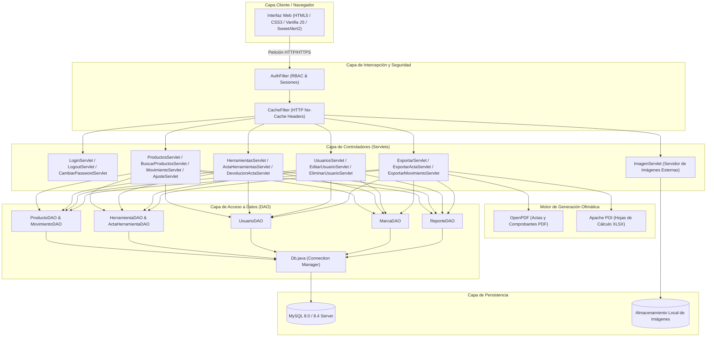
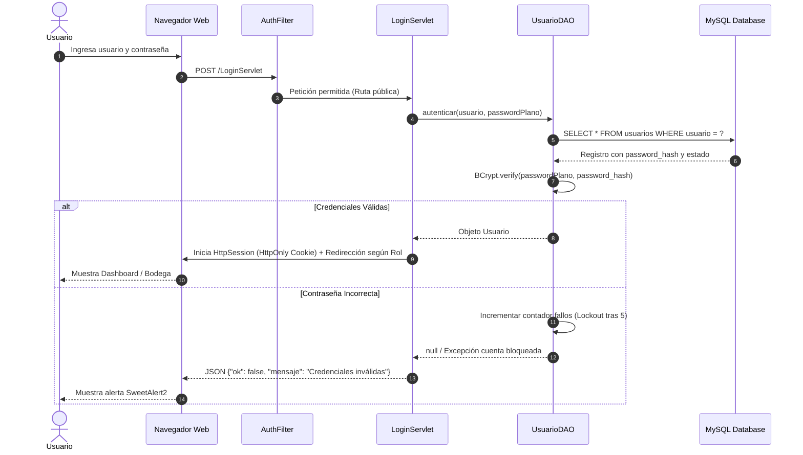
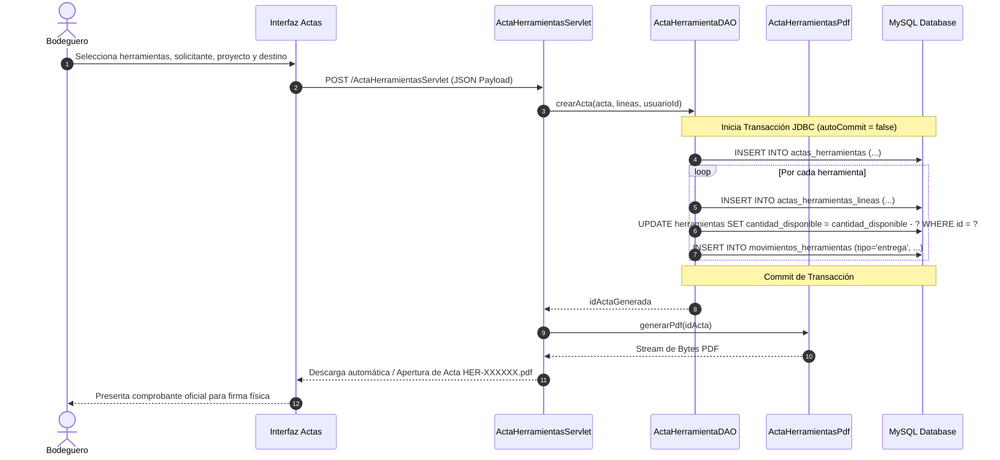

# Documento de Arquitectura de Software — Sistema de Inventario FAINCA

Este documento detalla el diseño arquitectónico, los patrones de software, la organización en capas, las políticas transaccionales y el modelo de seguridad implementados en el **Sistema de Inventario FAINCA**.

---

## 🏛 1. Visión General de la Arquitectura

El sistema implementa una arquitectura multicapa **MVC (Modelo-Vista-Controlador)** clásica, construida con estándares modernos de **Jakarta EE 5.0 (Servlet API 5.0)** sobre **Java 21 LTS**, prescindiendo intencionalmente de frameworks pesados para garantizar:

- Máximo rendimiento y bajo consumo de memoria RAM.
- Inicio y despliegue casi instantáneo.
- Compatibilidad directa con cualquier contenedor de Servlets 5.0+ (Jetty 11, Tomcat 10.1+).
- Trazabilidad y control total sobre las transacciones de base de datos a nivel de JDBC.



---

## 🧩 2. Descripción Detallada de Capas

### 2.1 Capa de Presentación (Vistas y Clientes)
- **Tecnología**: JavaServer Pages (JSP) + JSTL (JavaServer Pages Standard Tag Library).
- **Estilos**: CSS3 estructurado con variables corporativas (`--color-primary: #f5a623`, `--color-dark: #1e293b`, etc.), diseño responsivo para pantallas de escritorio y dispositivos móviles de bodega.
- **Interactividad Cliente**: JavaScript Vanilla moderno (Fetch API asíncrono) para búsquedas en tiempo real con debounce, autocompletado de códigos/herramientas y modales dinámicos.
- **Notificaciones y Alertas**: `SweetAlert2` para confirmaciones de eliminación, alertas de stock mínimo y mensajes de éxito transaccional.

### 2.2 Capa de Intercepción y Filtros
- **`AuthFilter` (`@WebFilter("/*")`)**:
  - Intercepta todas las peticiones entrantes.
  - Verifica si la ruta solicitada es pública (`/login.jsp`, `/LoginServlet`, estáticos `/css/`, `/js/`, `/images/`, `/vendor/`).
  - Si la ruta es privada, valida la existencia de la sesión HTTP (`HttpSession`) y el objeto `Usuario`.
  - Evalúa la matriz de autorización por rol (`superadmin`, `admin`, `ventas`). Si la petición es asíncrona (AJAX), responde con código HTTP `401 Unauthorized` o `403 Forbidden` en JSON; si es navegación web, redirige a `login.jsp` o `index.jsp`.
- **`CacheFilter`**:
  - Aplica encabezados `Cache-Control: no-cache, no-store, must-revalidate` en vistas dinámicas para evitar que información sensible o desactualizada quede almacenada en la caché del navegador del operador.

### 2.3 Capa de Controladores (Jakarta Servlets)
- Implementan `HttpServlet` utilizando anotaciones `@WebServlet("/NombreServlet")`.
- Heredan de una clase base común (`BaseServlet`) que encapsula métodos auxiliares para:
  - Extracción segura de parámetros y casting.
  - Respuestas JSON estructuradas (`{"ok": true, ...}` o `{"ok": false, "mensaje": "..."}`).
  - Manejo uniforme de excepciones y logs de depuración.

### 2.4 Capa de Acceso a Datos (DAO)
- Implementa el patrón **Data Access Object (DAO)** para desacoplar completamente el código SQL del flujo web.
- Uso estricto de `PreparedStatement` en todas las consultas y mutaciones para mitigar el 100% de los riesgos de **Inyección SQL (SQL Injection)**.
- Mapeo bidireccional entre `ResultSet` y objetos POJO de dominio (`Objetos.*`).

---

## 🔄 3. Gestión de Transacciones y Consistencia ACID

Para garantizar que el inventario nunca sufra inconsistencias o descuadres contables, las operaciones críticas que afectan a múltiples tablas se ejecutan bajo transacciones JDBC manuales:

```java
Connection conn = Db.getConnection();
try {
    conn.setAutoCommit(false); // Inicio de transacción atómica
    
    // 1. Actualizar balance de existencias
    // 2. Insertar registro en el libro mayor de movimientos
    // 3. Actualizar estado de acta o líneas relacionadas
    
    conn.commit(); // Confirmación de todos los cambios
} catch (SQLException e) {
    conn.rollback(); // Reversión total ante cualquier fallo
    throw e;
} finally {
    conn.setAutoCommit(true);
    conn.close();
}
```

### Casos Críticos de Transaccionalidad
1. **Ingreso/Egreso Masivo de Bodega #1**: Si se registran 10 productos en un mismo comprobante y el número 7 falla (ej. stock insuficiente), la transacción realiza un *rollback* completo: ningún producto se descuenta y no se genera movimiento parcial.
2. **Emisión de Acta de Herramientas**: La cabecera del acta, las líneas de herramientas solicitadas y el descuento de `cantidad_disponible` se confirman de forma conjunta.
3. **Recepción y Devolución de Herramientas**: La declaración de unidades que vuelven en buen estado, dañadas o declaradas perdidas se liquida en una única transacción atómica.

---

## 📊 4. Diagramas de Secuencia

### 4.1 Flujo de Autenticación y Enrutamiento por Rol



### 4.2 Flujo de Emisión de Acta de Herramientas con Generación de PDF



---

## 🔒 5. Modelo de Seguridad y Endurecimiento

| Dimensión | Medida Implementada |
|---|---|
| **Almacenamiento de Claves** | Hash criptográfico unidireccional con **BCrypt** (factor de costo 10 con sal aleatoria generada por hardware). |
| **Mitigación de Fuerza Bruta** | Bloqueo automático de 5 minutos al alcanzar 5 intentos fallidos consecutivos por usuario. |
| **Integridad de Parámetros** | Uso de `PreparedStatement` con tipos de datos estrictos en el 100% de operaciones SQL. |
| **Aislamiento de Sesión** | Sesiones HTTP configuradas con directiva `HttpOnly = true` en `web.xml` para prevenir ataques de robo de sesión mediante XSS. |
| **Persistencia de Archivos** | Las fotos de productos se almacenan fuera del directorio `webapp/` y se sirven a través de un `ImagenServlet` sanitizado que valida nombres y rutas absolutas, previniendo vulnerabilidades de *Path Traversal*. |
| **Cifrado en Tránsito (HTTPS)** | Infraestructura lista con certificados PKCS12 en `config/jetty-ssl.xml` y redirección en `AuthFilter` para entornos productivos. |

---

## 📈 6. Escalabilidad y Rendimiento

- **Pool de Conexiones**: Preparado para integrarse con pools de alto rendimiento como Apache Commons DBCP2 o HikariCP en despliegues con alta concurrencia.
- **Índices de Base de Datos**: Índices optimizados en columnas de búsqueda recurrente (`productos.nombre`, `marcas.nombre`, `herramientas.nombre`, `movimientos.idx_producto_fecha`, `movimientos.lote`).
- **Paginación y Búsqueda Asíncrona**: Búsquedas dinámicas limitadas en el servidor para evitar transferencias innecesarias de memoria entre el gestor MySQL y la JVM.

