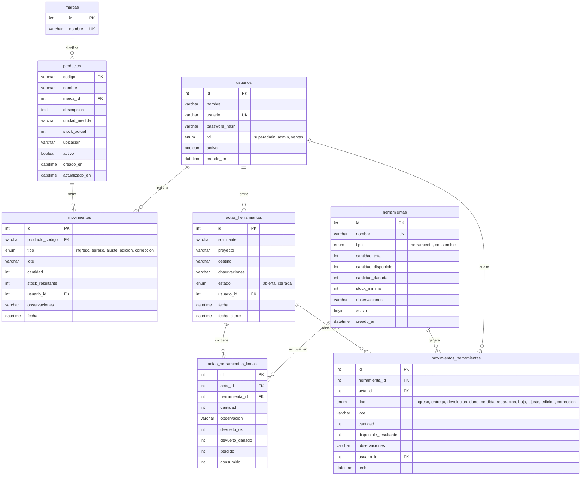

# Diccionario y Modelo de Base de Datos — FAINCA Group

Este documento describe la estructura relacional, tipos de datos, restricciones de integridad referencial, índices y reglas de negocio del esquema de base de datos **`fainca_inventario`** en **MySQL 8**.

---

## 🗺 1. Diagrama Entidad-Relación (ERD)



---

## 🗃 2. Diccionario de Datos por Tablas

### 2.1 Tabla `usuarios`
Almacena las cuentas de usuario y credenciales del sistema con control de roles.

| Columna | Tipo de Dato | Nulo | Por Defecto | Clave | Descripción |
|---|---|:---:|---|:---:|---|
| `id` | `INT` | No | `AUTO_INCREMENT` | **PK** | Identificador secuencial único del usuario. |
| `nombre` | `VARCHAR(100)` | No | | | Nombre completo o identificador para mostrar en pantalla. |
| `usuario` | `VARCHAR(50)` | No | | **UK** | Nombre de usuario para inicio de sesión (único). |
| `password_hash` | `VARCHAR(255)` | No | | | Hash criptográfico seguro generado con BCrypt. |
| `rol` | `ENUM('superadmin', 'admin', 'ventas')` | No | `'ventas'` | | Nivel de privilegios y autorización de rutas. |
| `activo` | `BOOLEAN` | No | `TRUE` | | `1` = Cuenta habilitada, `0` = Cuenta deshabilitada. |
| `creado_en` | `DATETIME` | Sí | `CURRENT_TIMESTAMP` | | Fecha y hora de creación de la cuenta. |

---

### 2.2 Tabla `marcas`
Catálogo de fabricantes y marcas comerciales de los repuestos y productos de Bodega #1.

| Columna | Tipo de Dato | Nulo | Por Defecto | Clave | Descripción |
|---|---|:---:|---|:---:|---|
| `id` | `INT` | No | `AUTO_INCREMENT` | **PK** | Identificador numérico único de la marca. |
| `nombre` | `VARCHAR(100)` | No | | **UK** | Nombre comercial de la marca (ej. ABB, SIEMENS, BALLUFF). |

---

### 2.3 Tabla `productos` (Bodega #1)
Catálogo maestro de repuestos y productos comerciales que se gestionan bajo inventario de consumo definitivo.

| Columna | Tipo de Dato | Nulo | Por Defecto | Clave | Descripción |
|---|---|:---:|---|:---:|---|
| `codigo` | `VARCHAR(50)` | No | | **PK** | Código físico / SKU rotulado en el empaque o producto. |
| `nombre` | `VARCHAR(200)` | No | | **Index** | Nombre descriptivo del producto. |
| `marca_id` | `INT` | No | | **FK** | Referencia a `marcas(id)`. |
| `descripcion` | `TEXT` | Sí | `NULL` | | Especificaciones técnicas o notas adicionales. |
| `unidad_medida` | `VARCHAR(20)` | No | `'unidad'` | | Unidad de control (ej. unidad, metro, kit, caja). |
| `stock_actual` | `INT` | No | `0` | | Existencias físicas reales en Bodega #1. |
| `ubicacion` | `VARCHAR(100)` | Sí | `NULL` | | Coordenada física en estantería (ej. `BA01`, `BD03`). |
| `activo` | `BOOLEAN` | No | `TRUE` | | `1` = Activo, `0` = Baja lógica (oculto en búsquedas). |
| `creado_en` | `DATETIME` | Sí | `CURRENT_TIMESTAMP` | | Fecha y hora de registro inicial. |
| `actualizado_en` | `DATETIME` | Sí | `CURRENT_TIMESTAMP ON UPDATE` | | Fecha y hora de la última modificación. |

---

### 2.4 Tabla `movimientos` (Bodega #1)
Libro mayor inmutable que audita cronológicamente todas las alteraciones de stock y ediciones en Bodega #1.

| Columna | Tipo de Dato | Nulo | Por Defecto | Clave | Descripción |
|---|---|:---:|---|:---:|---|
| `id` | `INT` | No | `AUTO_INCREMENT` | **PK** | Identificador secuencial del movimiento. |
| `producto_codigo` | `VARCHAR(50)` | No | | **FK** | Referencia a `productos(codigo)`. |
| `tipo` | `ENUM('ingreso', 'egreso', 'ajuste', 'edicion', 'correccion')` | No | | | Tipo de operación contable o documental. |
| `lote` | `VARCHAR(36)` | Sí | `NULL` | **Index** | UUID o código de lote para agrupar múltiples ítems en un mismo comprobante. |
| `cantidad` | `INT` | No | | | Unidades añadidas (positivo), retiradas (negativo/positivo según tipo) o ajustadas. |
| `stock_resultante` | `INT` | No | | | Saldo exacto de existencias tras aplicar la operación. |
| `usuario_id` | `INT` | No | | **FK** | Referencia a `usuarios(id)` del operador responsable. |
| `observaciones` | `VARCHAR(1000)` | Sí | `NULL` | | Detalle, motivo, cliente o número de factura/guía. |
| `fecha` | `DATETIME` | Sí | `CURRENT_TIMESTAMP` | **Index** | Fecha efectiva del movimiento. |

---

### 2.5 Tabla `herramientas` (Bodega de Herramientas)
Catálogo y balance en tiempo real de herramientas y consumibles de planta.

| Columna | Tipo de Dato | Nulo | Por Defecto | Clave | Descripción |
|---|---|:---:|---|:---:|---|
| `id` | `INT` | No | `AUTO_INCREMENT` | **PK** | Identificador numérico único del ítem. |
| `nombre` | `VARCHAR(200)` | No | | **UK** | Nombre de la herramienta/consumible en MAYÚSCULAS (único). |
| `tipo` | `ENUM('herramienta', 'consumible')` | No | | | `herramienta` = Debe retornar; `consumible` = Se gasta. |
| `cantidad_total` | `INT` | No | `0` | | Inventario global propiedad de la empresa. |
| `cantidad_disponible`| `INT` | No | `0` | | Unidades en bodega listas para ser entregadas. |
| `cantidad_danada` | `INT` | No | `0` | | Unidades averiadas en taller / pendientes de resolver. |
| `stock_minimo` | `INT` | Sí | `NULL` | | Umbral de alerta para reposición preventiva. |
| `observaciones` | `VARCHAR(500)` | Sí | `NULL` | | Números de serie, especificaciones o accesorios. |
| `activo` | `TINYINT(1)` | No | `1` | | `1` = Activa en catálogo, `0` = Desactivada. |
| `creado_en` | `DATETIME` | No | `CURRENT_TIMESTAMP` | | Fecha de registro en el catálogo. |

> **Fórmula de balance de herramientas**:
> $$\text{En Proyectos} = \text{cantidad\_total} - \text{cantidad\_disponible} - \text{cantidad\_danada}$$

---

### 2.6 Tabla `actas_herramientas`
Documentos de entrega temporal de herramientas a personal técnico para proyectos.

| Columna | Tipo de Dato | Nulo | Por Defecto | Clave | Descripción |
|---|---|:---:|---|:---:|---|
| `id` | `INT` | No | `AUTO_INCREMENT` | **PK** | Número secuencial del acta (visualizado como `HER-00000X`). |
| `solicitante` | `VARCHAR(120)` | No | | | Nombre del técnico o responsable que recibe las herramientas. |
| `proyecto` | `VARCHAR(200)` | No | | | Nombre del proyecto, planta o cliente destino. |
| `destino` | `VARCHAR(200)` | Sí | `NULL` | | Ubicación geográfica o instalación específica. |
| `observaciones` | `VARCHAR(1000)` | Sí | `NULL` | | Comentarios de entrega (ej. placa de vehículo, cuadrilla). |
| `estado` | `ENUM('abierta', 'cerrada')` | No | `'abierta'` | **Index** | `abierta` = Tiene ítems pendientes de retornar; `cerrada` = Liquidada. |
| `usuario_id` | `INT` | No | | **FK** | Operador de bodega que emitió el acta (`usuarios(id)`). |
| `fecha` | `DATETIME` | No | `CURRENT_TIMESTAMP` | **Index** | Fecha y hora de emisión del acta. |
| `fecha_cierre` | `DATETIME` | Sí | `NULL` | | Fecha y hora en la que se completaron todas las devoluciones. |

---

### 2.7 Tabla `actas_herramientas_lineas`
Detalle de ítems entregados en un acta y su estado acumulado de liquidación.

| Columna | Tipo de Dato | Nulo | Por Defecto | Clave | Descripción |
|---|---|:---:|---|:---:|---|
| `id` | `INT` | No | `AUTO_INCREMENT` | **PK** | Identificador de la línea. |
| `acta_id` | `INT` | No | | **FK** | Referencia a `actas_herramientas(id)`. |
| `herramienta_id` | `INT` | No | | **FK** | Referencia a `herramientas(id)`. |
| `cantidad` | `INT` | No | | | Cantidad total solicitada y entregada originalmente. |
| `observacion` | `VARCHAR(300)` | Sí | `NULL` | | Notas puntuales sobre este ítem en la entrega. |
| `devuelto_ok` | `INT` | No | `0` | | Unidades acumuladas devueltas en buen estado. |
| `devuelto_danado`| `INT` | No | `0` | | Unidades acumuladas devueltas averiadas. |
| `perdido` | `INT` | No | `0` | | Unidades acumuladas declaradas como pérdidas/extraviadas. |
| `consumido` | `INT` | No | `0` | | Unidades gastadas en obra (aplica para consumibles). |

> **Criterio de liquidación de línea**:
> Una línea está completamente saldada cuando $\text{cantidad} = \text{devuelto\_ok} + \text{devuelto\_danado} + \text{perdido} + \text{consumido}$.

---

### 2.8 Tabla `movimientos_herramientas`
Libro mayor inmutable de todas las transacciones que modifican el catálogo o balance de herramientas.

| Columna | Tipo de Dato | Nulo | Por Defecto | Clave | Descripción |
|---|---|:---:|---|:---:|---|
| `id` | `INT` | No | `AUTO_INCREMENT` | **PK** | Identificador secuencial del movimiento. |
| `herramienta_id` | `INT` | No | | **FK** | Referencia a `herramientas(id)`. |
| `acta_id` | `INT` | Sí | `NULL` | **FK** | Referencia a `actas_herramientas(id)` (si proviene de entrega/devolución). |
| `tipo` | `ENUM(...)` | No | | | `ingreso`, `entrega`, `devolucion`, `dano`, `perdida`, `reparacion`, `baja`, `ajuste`, `edicion`, `correccion`. |
| `lote` | `VARCHAR(36)` | Sí | `NULL` | **Index** | UUID para agrupar movimientos de una misma operación. |
| `cantidad` | `INT` | No | | | Unidades involucradas en la operación. |
| `disponible_resultante`| `INT`| No | | | Saldo de `cantidad_disponible` en bodega tras la operación. |
| `observaciones` | `VARCHAR(1000)` | Sí | `NULL` | | Justificación técnica del movimiento. |
| `usuario_id` | `INT` | No | | **FK** | Operador responsable (`usuarios(id)`). |
| `fecha` | `DATETIME` | No | `CURRENT_TIMESTAMP` | **Index** | Momento de registro de la transacción. |

---

## 🛠 3. Scripts de Mantenimiento y Respaldos

### Exportar Respaldo Completo de la Base de Datos
```bash
mysqldump -u root -p \
  --single-transaction \
  --routines \
  --triggers \
  --default-character-set=utf8mb4 \
  fainca_inventario > "respaldo_fainca_$(date +%Y%m%d_%H%M%S).sql"
```

### Restaurar Respaldo
```bash
mysql -u root -p fainca_inventario < "ruta/al/archivo_respaldo.sql"
```

