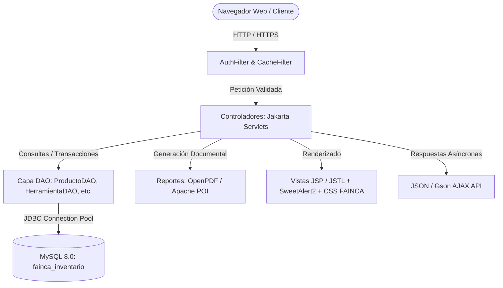

# Sistema de Gestión de Inventario — FAINCA Group

[](https://openjdk.org/)
[](https://jakarta.ee/)
[](https://www.mysql.com/)
[](https://maven.apache.org/)
[](https://www.eclipse.org/jetty/)
[](https://github.com/LibrePDF/OpenPDF)
[](https://poi.apache.org/)

Sistema integral de gestión, control de inventario y trazabilidad operativa desarrollado para **FAINCA Group**. El sistema unifica y reemplaza hojas de cálculo dispersas mediante una base de datos centralizada en MySQL 8 y una interfaz web moderna, ágil y protegida por control de acceso basado en roles (RBAC).

---

## 📑 Tabla de Contenidos

- [Descripción General](#-descripción-general)
- [Módulos del Sistema](#-módulos-del-sistema)
  - [1. Bodega #1: Productos y Repuestos](#1-bodega-1-productos-y-repuestos)
  - [2. Bodega de Herramientas y Consumibles](#2-bodega-de-herramientas-y-consumibles)
  - [3. Gestión de Usuarios y Seguridad](#3-gestión-de-usuarios-y-seguridad)
  - [4. Reportes y Exportación](#4-reportes-y-exportación)
- [Arquitectura y Stack Tecnológico](#-arquitectura-y-stack-tecnológico)
- [Estructura del Proyecto](#-estructura-del-proyecto)
- [Requisitos Previos](#-requisitos-previos)
- [Instalación y Puesta en Marcha](#-instalación-y-puesta-en-marcha)
  - [Paso 1: Restaurar la Base de Datos](#paso-1-restaurar-la-base-de-datos)
  - [Paso 2: Configurar Parámetros del Entorno](#paso-2-configurar-parámetros-del-entorno)
  - [Paso 3: Ejecutar la Aplicación](#paso-3-ejecutar-la-aplicación)
- [Credenciales de Acceso por Defecto](#-credenciales-de-acceso-por-defecto)
- [Empaquetado y Despliegue en Producción](#-empaquetado-y-despliegue-en-producción)
- [Seguridad y Buenas Prácticas](#-seguridad-y-buenas-prácticas)
- [Documentación Adicional](#-documentación-adicional)
- [Autores](#-autores)

---

## 🏢 Descripción General

FAINCA Group administra dos flujos de inventario operativos totalmente diferenciados por su naturaleza de negocio:

1. **Flujo de Consumo / Comercialización (Bodega #1)**: Productos, repuestos eléctricos y componentes mecánicos que se registran, venden o consumen definitivamente sin retorno a bodega.
2. **Flujo de Préstamo y Retorno (Bodega de Herramientas)**: Equipos, herramientas y maquinaria que salen a proyectos con personal de planta y **deben retornar** en buen estado, o declararse dañados/perdidos con soporte documental.

Ambos módulos operan de forma independiente dentro de la misma aplicación web, garantizando interfaces dedicadas, esquemas relacionales independientes y libros mayores de auditoría inmutables.

---

## 📦 Módulos del Sistema

### 1. Bodega #1 (Productos y Repuestos)
- **Catálogo Inteligente**: Búsqueda en tiempo real por código, nombre, marca y ubicación física con visualización de stock y fotografías de alta resolución.
- **Transacciones por Lotes (Multi-producto)**: Ingresos y egresos masivos con asignación de número de documento/observación y fecha retroactiva u horaria actual.
- **Ajustes de Inventario**: Correcciones justificadas de conteo físico y reclasificación de ubicaciones.
- **Auditoría e Historial**: Libro inmutable de movimientos (`ingreso`, `egreso`, `ajuste`, `edicion`, `correccion`) registrando usuario ejecutor, fecha exacta y stock resultante.
- **Baja Lógica**: Eliminación segura mediante desactivación (`activo = 0`), preservando intacta la integridad histórica del producto.

### 2. Bodega de Herramientas y Consumibles
- **Catálogo Unificado de 4 Estados**:
  - `Disponible`: Unidades en bodega listas para ser prestadas.
  - `En proyectos`: Unidades actualmente en campo bajo responsabilidad de un solicitante.
  - `Dañadas`: Unidades averiadas en espera de reparación o baja.
  - `Total`: Stock global de la empresa ($Total = Disponible + En\ proyectos + Dañadas$).
- **Diferenciación de Ítem**:
  - *Herramienta*: Sale y debe retornar (ej. taladros, multímetros, llaves).
  - *Consumible*: Se descuenta directamente del total al entregarse (ej. pernos, discos de corte, cintas).
- **Actas de Entrega con Firma**: Generación de documentos oficiales en PDF con identificador correlativo (`HER-XXXXXX`), solicitante, proyecto, destino y casillas de firma física ("Entregado por" y "Recibido por").
- **Flujo de Recepciones / Devoluciones**: Liquidación de actas abiertas permitiendo devoluciones parciales o totales clasificando las unidades en: `Buen estado` (vuelven a Disponible), `Dañadas` (pasan a cuarentena) o `Perdidas` (se descuentan del Total).
- **Taller de Reparaciones y Bajas**: Interfaz para reincorporar herramientas reparadas a stock disponible o darlas de baja definitiva con justificación.

### 3. Gestión de Usuarios y Seguridad
- **Roles y Permisos (RBAC)**:
  - `superadmin`: Acceso total + administración y creación de usuarios, reseteo de contraseñas y auditoría global.
  - `admin`: Gestión operativa completa de Bodega #1, Herramientas, Actas y Reportes.
  - `ventas`: Consulta de existencias en tiempo real, exportación de reportes y cambio de contraseña propia.
- **Criptografía BCrypt**: Hasheo unidireccional de contraseñas con sal aleatoria.
- **Protección contra Fuerza Bruta**: Bloqueo temporal automático de cuentas por 5 minutos tras 5 intentos fallidos continuos.
- **Filtro de Autenticación Centralizado (`AuthFilter`)**: Validación de sesión HttpOnly y control estricto de rutas y APIs AJAX.

### 4. Reportes y Exportación
- **Exportación a Microsoft Excel (.xlsx)**: Generación dinámica con Apache POI de listados de stock clasificados por marca y ubicación.
- **Generación de Reportes PDF**: Catálogos valorados y actas oficiales mediante LibrePDF / OpenPDF.

---

## 🛠 Arquitectura y Stack Tecnológico

La aplicación implementa una arquitectura multicapa **MVC (Modelo-Vista-Controlador)** desacoplada y basada en estándares puros de Java empresarial:



- **Lenguaje**: Java 21 (LTS)
- **Capa Web**: Jakarta Servlet API 5.0, JSP (JavaServer Pages), JSTL
- **Contenedor / Servidor Web**: Eclipse Jetty 11.0.24 (Desarrollo) / Compatible con Apache Tomcat 10.1+
- **Motor de Base de Datos**: MySQL Server 8.0+ / 8.4+
- **Acceso a Datos**: JDBC nativo con transacciones manuales (`setAutoCommit(false)`) para operaciones críticas
- **Criptografía**: `at.favre.lib:bcrypt` v0.10.2
- **Procesamiento JSON**: Google Gson v2.11.0
- **Generación Ofimática**: Apache POI 5.3.0 (OOXML) y LibrePDF OpenPDF 1.3.35
- **Frontend**: HTML5 Semántico, CSS3 personalizado (Paleta corporativa FAINCA), JavaScript Vanilla asíncrono (Fetch API), FontAwesome 6 y SweetAlert2

---

## 📂 Estructura del Proyecto

```text
Fainca_Group/
├── .gitattributes                     # Normalización de saltos de línea en Git
├── .gitignore                        # Reglas de exclusión para Git (target, IDEs, SO)
├── CHANGELOG.md                      # Historial de versiones del proyecto
├── CONTRIBUTING.md                   # Guía de contribución y buenas prácticas
├── LICENSE                           # Licencia y derechos de uso
├── README.md                         # Documentación principal del repositorio
├── LEEME-PRIMERO.txt                 # Instrucciones originales de entrega de TI
├── iniciar-servidor.command          # Acceso directo para macOS
│
├── 1-Aplicacion/                     # Código fuente y configuración de la aplicación
│   ├── README.md                     # Guía técnica específica del módulo Java
│   ├── db/                           # Scripts SQL de esquema y usuarios iniciales
│   │   ├── schema.sql
│   │   └── usuarios-iniciales.sql
│   └── fainca/                       # Proyecto Maven
│       ├── pom.xml                   # Descriptor de dependencias y plugins Maven
│       ├── iniciar-servidor.sh       # Script de arranque para macOS/Linux
│       ├── config/                   # Configuración SSL / HTTPS
│       │   ├── LEEME-HTTPS.md        # Instructivo técnico para reactivar HTTPS
│       │   ├── fainca-certificado.cer
│       │   ├── fainca-ssl.p12
│       │   └── jetty-ssl.xml
│       └── src/main/
│           ├── java/                 # Backend Java (Dao, Filtros, Objetos, Reportes, Servlets)
│           ├── resources/            # Configuración (db.properties, db.properties.example)
│           └── webapp/               # Vistas JSP, hojas de estilo CSS, scripts JS e imágenes
│
├── 2-Base-de-datos/                  # Volcado completo de base de datos
│   └── base-datos-completa.sql       # Dump MySQL con estructura y datos completos
│
├── 3-Imagenes-de-productos/          # Repositorio externo de fotografías de productos (~1290 imgs)
│
└── 4-Documentacion/                  # Suite documental técnica y funcional detallada
    ├── ARQUITECTURA.md               # Detalle de diseño de software y capas
    ├── BASE_DE_DATOS.md              # Diccionario de datos y diagrama ER
    ├── MANUAL_DE_USUARIO.md          # Manual de operación funcional
    ├── GUIA_DESPLIEGUE_Y_SEGURIDAD.md # Guía para administradores de sistemas y TI
    ├── RUTAS_Y_ENDPOINTS.md          # Matriz de endpoints y servlets
    ├── ANEXO-Bodega-de-herramientas.txt
    ├── Documentacion Tecnica - Sistema de Inventario FAINCA.pdf
    └── Manual de Usuario - Sistema de Inventario FAINCA.pdf
```

---

## ⚙️ Requisitos Previos

Antes de desplegar o ejecutar el proyecto, asegúrese de contar con:

- **Java Development Kit (JDK)**: Versión 21 o superior (recomendado Eclipse Temurin 21 o Oracle JDK 21+).
- **Apache Maven**: Versión 3.9 o superior.
- **MySQL Server**: Versión 8.0 o superior (compatible con MySQL 8.4 LTS).
- **Navegador Web Moderno**: Google Chrome, Mozilla Firefox, Microsoft Edge o Safari.

---

## 🚀 Instalación y Puesta en Marcha

### Paso 1: Restaurar la Base de Datos

Abra una terminal o consola de comandos y cargue el volcado completo que incluye las 8 tablas con datos maestros:

```bash
mysql -u root -p < "2-Base-de-datos/base-datos-completa.sql"
```

> **Nota**: El archivo `base-datos-completa.sql` ya incluye todas las migraciones acumuladas para Bodega #1 y Bodega de Herramientas.

### Paso 2: Configurar Parámetros del Entorno

1. Navegue al directorio de recursos de la aplicación:
   ```bash
   cd 1-Aplicacion/fainca/src/main/resources/
   ```
2. Copie la plantilla de configuración:
   ```bash
   cp db.properties.example db.properties
   ```
3. Edite `db.properties` con los parámetros correspondientes a su servidor:
   ```properties
   db.url=jdbc:mysql://localhost:3306/fainca_inventario?useSSL=false&allowPublicKeyRetrieval=true&serverTimezone=America/Guayaquil
   db.usuario=root
   db.password=TuContrasena
   app.imagenes.carpeta=/ruta/absoluta/a/3-Imagenes-de-productos
   ```

### Paso 3: Ejecutar la Aplicación

#### Opción A: Modo Desarrollo con Jetty Maven Plugin
Desde el directorio `1-Aplicacion/fainca`:

```bash
mvn jetty:run
```

Para ejecutar en un puerto alternativo (ej. 3001):
```bash
mvn jetty:run -Dpuerto=3001
```

#### Opción B: Script Automatizado (macOS / Linux)
Desde la raíz del proyecto:
```bash
./1-Aplicacion/fainca/iniciar-servidor.sh
```
*(En macOS también puede hacer doble clic sobre `iniciar-servidor.command`).*

Una vez iniciado el servidor, abra su navegador e ingrese a:
👉 **`http://localhost:3000/`**

---

## 🔐 Credenciales de Acceso por Defecto

El sistema incluye cuentas iniciales para pruebas y administración:

| Usuario | Rol | Contraseña Temporal | Propósito |
|---|---|---|---|
| `admin` | `superadmin` | `CambiarClave123` | Administración total del sistema y gestión de usuarios |
| `victorm` | `admin` | `CambiarClave123` | Administración operativa de inventario y herramientas |
| `javierp` | `admin` | `CambiarClave123` | Administración operativa de inventario y herramientas |
| `ventas` | `ventas` | `CambiarClave123` | Consulta de existencias y reportes |

> **Importante**: Por motivos de seguridad, cambie las contraseñas temporales desde el menú de usuario tras el primer inicio de sesión.

---

## 🚢 Empaquetado y Despliegue en Producción

Para compilar y generar el archivo distribuible `.war`:

```bash
cd 1-Aplicacion/fainca
mvn clean package
```

El artefacto generado se ubicará en:
📁 **`1-Aplicacion/fainca/target/fainca.war`**

### Compatibilidad de Servidores de Aplicaciones
- **Apache Tomcat 10.1+** (Requiere soporte para `jakarta.servlet-api 5.0+`).
- **Eclipse Jetty 11+** / **WildFly 27+**.
- *Nota*: NO desplegar en Tomcat 9 o inferior debido al cambio de espacio de nombres de `javax.servlet` a `jakarta.servlet`.

Consulte la [Guía de Despliegue y Seguridad](4-Documentacion/GUIA_DESPLIEGUE_Y_SEGURIDAD.md) para configuraciones avanzadas con Systemd, Nginx Proxy Inverso y certificados TLS.

---

## 🛡 Seguridad y Buenas Prácticas

- **Consultas Parametrizadas**: Todos los DAOs utilizan `PreparedStatement` para prevenir inyecciones SQL (SQLi).
- **Protección de Sesión**: Cookies con directiva `HttpOnly` y tiempo de expiración controlado.
- **Hashing de Contraseñas**: Implementación robusta con BCrypt (cost factor 10).
- **Control de Intentos de Acceso**: Bloqueo temporal por 5 minutos ante 5 intentos fallidos consecutivos.
- **HTTPS / Cifrado TLS**: Infraestructura lista y documentada para activar certificados SSL internos o de CA reconocida (ver `1-Aplicacion/fainca/config/LEEME-HTTPS.md`).

---

## 📚 Documentación Adicional

Para consultar los manuales técnicos y funcionales detallados, acceda a la carpeta [`4-Documentacion/`](4-Documentacion/):

- 🏛 [**Arquitectura de Software**](4-Documentacion/ARQUITECTURA.md) — Patrones, capas, ciclo de vida y diseño técnico.
- 🗄 [**Diccionario y Modelo de Base de Datos**](4-Documentacion/BASE_DE_DATOS.md) — Estructura de tablas, relaciones y diagramas ER.
- 📖 [**Manual de Usuario Completo**](4-Documentacion/MANUAL_DE_USUARIO.md) — Guía interactiva de uso para operadores y administradores.
- ⚙️ [**Guía de Despliegue y Seguridad**](4-Documentacion/GUIA_DESPLIEGUE_Y_SEGURIDAD.md) — Procedimientos para TI, servidores de producción y respaldos.
- 🔌 [**Matriz de Rutas y Endpoints**](4-Documentacion/RUTAS_Y_ENDPOINTS.md) — Referencia técnica de Servlets y peticiones AJAX.

---

## 👥 Autores

- **J. Peña & S. Vinces** — Desarrollo de software, arquitectura de sistemas y base de datos.
- **Departamento de TI — FAINCA Group** — Mantenimiento e infraestructura.

---
© 2026 FAINCA Group. Todos los derechos reservados.

